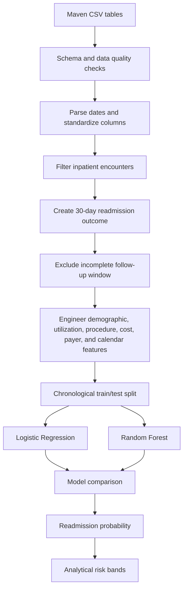

# Predicting 30-Day Hospital Readmission Risk

An end-to-end healthcare analytics and machine learning project using the **Maven Analytics Hospital Patient Records** dataset.

The project transforms longitudinal hospital encounter data into an encounter-level machine learning dataset and estimates the probability of a subsequent inpatient admission within 30 days of discharge.

> **Important:** The source dataset is synthetic. The model in this repository is an analytical demonstration and is not intended for clinical decision-making.

---

## Project Objective

The central question is:

> **Can information available from a hospital encounter and a patient's prior utilization history help identify encounters associated with a higher probability of 30-day inpatient readmission?**

The project covers:

- relational data inspection and quality checks;
- readmission target engineering;
- leakage-aware historical feature engineering;
- chronological train/test validation;
- Logistic Regression and Random Forest classification;
- evaluation with precision, recall, F1, ROC-AUC, and PR-AUC;
- model interpretation with permutation importance; and
- encounter-level readmission probability and analytical risk bands.

---

## Data Source

**Maven Analytics — Hospital Patient Records**

Maven describes the dataset as synthetic patient records from Massachusetts General Hospital spanning 2011–2022, including patient demographics, insurance coverage, medical encounters, and procedures.

Download the source CSV files from the Maven Analytics Data Playground and place them in:

```text
data/raw/
```

Expected filenames:

```text
patients.csv
encounters.csv
procedures.csv
payers.csv
organizations.csv
```

Raw data is intentionally excluded from Git by `.gitignore`.

---

## Repository Structure

```text
maven-hospital-readmission-ml/
│
├── data/
│   ├── raw/
│   │   └── .gitkeep
│   └── processed/
│       └── .gitkeep
│
├── docs/
│   ├── DATA_DICTIONARY.md
│   ├── METHODOLOGY.md
│   └── MODEL_CARD.md
│
├── models/
│   └── .gitkeep
│
├── notebooks/
│   ├── 01_data_understanding.ipynb
│   ├── 02_data_cleaning_eda.ipynb
│   ├── 03_feature_engineering.ipynb
│   └── 04_modeling_evaluation.ipynb
│
├── reports/
│   └── figures/
│       └── .gitkeep
│
├── src/
│   ├── data_preparation.py
│   └── modeling.py
│
├── .gitignore
├── README.md
└── requirements.txt
```

---

## Workflow



---

## Outcome Definition

For each inpatient encounter:

1. encounters are sorted chronologically within each patient;
2. the next inpatient admission is identified;
3. the number of days from the current discharge to the next admission is calculated;
4. `readmitted_30d = 1` when the next inpatient admission begins within **0–30 days** after discharge; and
5. otherwise, `readmitted_30d = 0`.

To reduce right-censoring, encounters discharged within the final 30 days of observable data are excluded because they do not have a complete 30-day follow-up window.

---

## Final Features

### Patient Characteristics

- `age_at_admission`
- `gender`
- `race`
- `ethnicity`
- `marital`

### Current Encounter Characteristics

- `length_of_stay_days`
- `base_encounter_cost`
- `total_claim_cost`
- `payer_coverage`
- `procedure_count`

### Prior Utilization

- `prior_inpatient_visits`
- `prior_readmissions`
- `days_since_previous_discharge`
- `missing_prior_history`

### Calendar Characteristics

- `admission_month`
- `admission_dayofweek`
- `admission_weekend`

### Insurance

- `payer_name`

Several current-encounter variables become fully known only during or by the end of hospitalization. The current model is therefore best interpreted as a **discharge-time or post-encounter analytical model**, rather than a model that makes predictions strictly at admission.

---

## Leakage Controls

Several steps are used to reduce information leakage:

- encounters are ordered chronologically within each patient;
- future admissions are used only to construct the target;
- historical utilization features use information from earlier encounters only;
- prior readmission counts do not include the current encounter's outcome;
- encounters without a complete 30-day follow-up window are excluded;
- training and testing are separated chronologically; and
- preprocessing is fitted using training data and then applied to test data.

---

## Models

### Logistic Regression

Logistic Regression is used as an interpretable baseline with:

- median imputation for numeric variables;
- standard scaling;
- most-frequent imputation for categorical variables;
- one-hot encoding; and
- balanced class weights.

### Random Forest

Random Forest is used as a nonlinear comparison model with:

- the same preprocessing structure;
- balanced class weights;
- constrained tree depth and minimum leaf size; and
- a fixed random seed for reproducibility.

---

## Model Evaluation

A chronological 80/20 split produced:

| Partition | Encounters | Readmission Rate |
|---|---:|---:|
| Training | 905 | 37.13% |
| Test | 227 | 32.16% |

The majority-class baseline accuracy in the test set is approximately **67.84%**.

### Model Comparison

| Model | Accuracy | Precision | Recall | F1 | ROC-AUC | PR-AUC |
|---|---:|---:|---:|---:|---:|---:|
| Random Forest | 92.07% | 92.31% | 82.19% | 86.96% | 0.950 | 0.910 |
| Logistic Regression | 91.19% | 87.32% | 84.93% | 86.11% | 0.908 | 0.862 |

Using PR-AUC as the primary comparison metric and ROC-AUC as the secondary metric, **Random Forest is selected as the stronger model**.

At a classification threshold of 0.50, Random Forest produced:

- 149 true negatives;
- 60 true positives;
- 5 false positives; and
- 13 false negatives.

Permutation importance identified several leading predictors, including:

1. `base_encounter_cost`
2. `total_claim_cost`
3. `days_since_previous_discharge`
4. `procedure_count`
5. `prior_readmissions`
6. `payer_coverage`

Permutation importance represents predictive association rather than causality.

---

## Analytical Risk Bands

Predicted Random Forest probabilities are grouped into analytical risk bands:

| Probability | Risk Band | Test Encounters | Observed Readmission Rate |
|---|---|---:|---:|
| 0.00–0.30 | Low | 150 | 6.67% |
| >0.30–0.60 | Medium | 14 | 28.57% |
| >0.60–1.00 | High | 63 | 93.65% |

These cutoffs are descriptive analytical groupings and are **not clinically validated thresholds**. The Medium group also contains relatively few test encounters and should be interpreted cautiously.

---

## Setup

### 1. Create a Virtual Environment

Windows PowerShell:

```powershell
python -m venv .venv
.venv\Scripts\Activate.ps1
```

### 2. Install Dependencies

```bash
python -m pip install --upgrade pip
pip install -r requirements.txt
```

### 3. Add the Maven CSV Files

Place the five source files in:

```text
data/raw/
```

### 4. Run the Notebooks in Order

```text
01_data_understanding.ipynb
02_data_cleaning_eda.ipynb
03_feature_engineering.ipynb
04_modeling_evaluation.ipynb
```

---

## Generated Outputs

The analysis can generate outputs such as processed modeling data, model predictions, comparison metrics, and analytical figures.

Generated data, trained model artifacts, and figures can be excluded from source control through `.gitignore`.

---

## Reproducibility

A fixed `random_state = 42` is used where applicable.

Reusable data-preparation and modeling logic is maintained in the `src/` directory, while the notebooks document the analytical workflow and interpretation.

---

## Limitations

- The dataset is synthetic.
- The number of patients is relatively small for clinical predictive modeling.
- Important clinical variables such as laboratory results, medication history, detailed diagnoses, disease severity, and discharge disposition may not be available.
- Observed readmissions are limited to encounters represented in the source data.
- Model performance on this dataset should not be generalized to real hospital populations.
- Several strong predictors, including encounter costs and procedure counts, may only be fully known by the end of the index encounter.
- Demographic associations should remain descriptive and should not be interpreted as causal relationships.
- Subgroup performance and fairness would require additional evaluation before any real-world predictive use.

See `docs/MODEL_CARD.md` for additional model documentation.

---

## Data Availability

The source dataset is distributed separately by Maven Analytics and is not included in this repository.
